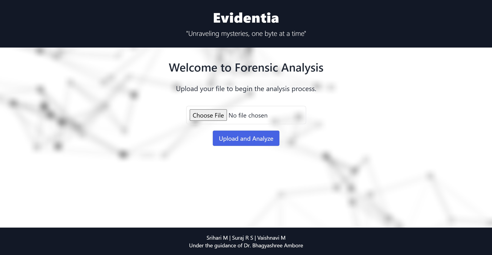

# AI-Driven Forensic Analysis: GenAI-Based Forensic Simulation System

**Team Members**: Srihari M, Suraj R S, Vaishnavi M  
**Part of**: VTU Syllabus (2021 Scheme)

---

## Table of Contents
- [AI-Driven Forensic Analysis: GenAI-Based Forensic Simulation System](#ai-driven-forensic-analysis-genai-based-forensic-simulation-system)
  - [Table of Contents](#table-of-contents)
  - [Overview](#overview)
  - [Key Features](#key-features)
  - [Technologies Used](#technologies-used)
  - [Installation and Setup](#installation-and-setup)
    - [Prerequisites](#prerequisites)
    - [Steps](#steps)
  - [Usage](#usage)
    - [Input File](#input-file)
    - [Features](#features)
  - [Project Structure](#project-structure)
  - [License](#license)
  - [Contributors](#contributors)
  - [Preview](#preview)
    - [Homepage](#homepage)

---

## Overview

The **AI-Driven Forensic Analysis System** leverages state-of-the-art Generative AI (GenAI) techniques to simulate and analyze crime scenes. This project, as part of the VTU Syllabus for the 2021 scheme, provides forensic experts, students, and researchers with an innovative tool for investigating and understanding forensic scenarios.

The system integrates a multi-agent architecture, 2D visualizations, and user-friendly interactions to ensure a seamless forensic analysis workflow.

---

## Key Features

1. **Multi-Agent Architecture**: Modular agents for encryption, image analysis, summarization, and simulation generation.
2. **3D Video-Based Crime Scene Visualization**: Generate dynamic 3D video based simulations from input narratives or evidence files.
3. **User-Friendly Interface**:
   - Single Page Application (SPA) approach for seamless navigation.
   - Intuitive menus for accessing analysis, reports, and simulations.
4. **Forensic Reports**: Generate detailed and encrypted forensic analysis reports.
5. **Evidence Management**: Decrypt and analyze collected evidence while maintaining data security.
6. **Responsive Frontend**: Includes light and dark mode, optimized for all screen sizes.

---

## Technologies Used

1. **Backend**: Flask, OpenAI GPT-4, Cryptography
2. **Frontend**: HTML, CSS, JavaScript (SPA-like functionality)
3. **Visualization**: Matplotlib
4. **Other Tools**:
   - `PyYAML` for configuration management
   - `luma` for video generation
   - `dotenv` for secure API key handling

---

## Installation and Setup

### Prerequisites

- Python 3.11 or above
- Virtual environment (recommended)

### Steps

1. **Clone the Repository**:
   ```bash
   git clone <repository-url>
   cd GenAI-Based-Forensic-Simulator
   ```

2. **Create a Virtual Environment**:
   ```bash
   python -m venv venv
   source venv/bin/activate   # On Windows, use venv\Scripts\activate
   ```

3. **Install Dependencies**:
   ```bash
   pip install -r requirements.txt
   ```

4. **Set Environment Variables (IMPORTANT)**:
   - Open the `.env` file in the `config` directory.
   - Add your OpenAI API key and Luma credentials:
     ```
     OPENAI_API_KEY=your_openai_api_key
     LUMA_API_KEY=your_luma_api_key
     ```

5. **Run the Application**:
   ```bash
   python app.py
   ```

6. **Access the Application**:
   Open your browser and navigate to your home port. The application works on any device on the same network!

---

## Usage

### Input File
1. Upload evidence files (e.g., images, narratives) via the homepage.
2. Click "Analyze" to begin the forensic analysis pipeline.

### Features
- **Navigation Menu**:
  - Image Analysis
  - Narrative Generation
  - Video Simulation
  - Forensic Reports
  - Evidence Management
- **Dynamic Visualizations**: Review 3D video-simulations and evidence breakdowns.

---

## Project Structure

```
GenAI-Based-Forensic-Simulator/
│
├── agents/                  # Core agents for specific tasks
├── config/                  # Configuration files (.env, YAML)
├── data/                    # Input, output, and simulation data
├── logs/                    # Application logs
├── static/                  # Static files (CSS, JS, Images)
├── templates/               # Frontend templates (HTML)
├── utils/                   # Utility scripts
├── app.py                   # Main Flask application
├── README.md                # Project documentation
└── requirements.txt         # Python dependencies
```

## License

This project is licensed under the [MIT License](LICENSE). You are free to use, modify, and distribute this software, provided you include proper attribution to the original authors.

--- 


## Contributors

- **Srihari M**
- **Suraj R S**
- **Vaishnavi M**

---

## Preview

### Homepage

